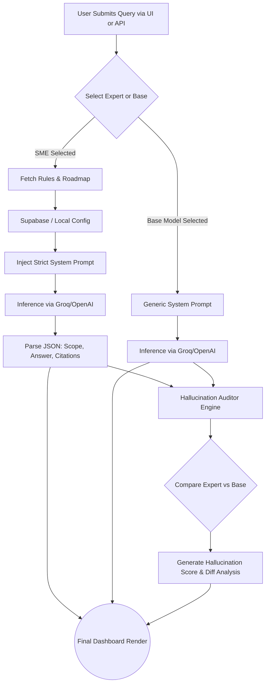

# ByteMe (Byte Expert) – Project Explanatory Document

## 1. Problem
As Large Language Models (LLMs) like GPT-4 and Llama 3 become ubiquitous, professionals face a critical bottleneck: **generic hallucination**. Standard AI models provide broad, generalized advice that often lacks domain-specific rigor. For high-stakes fields like structural engineering, strategic business consulting, or precision agriculture, relying on general-purpose AI is dangerous. Users must constantly write complex, rigorous prompts to keep the AI on track, leading to inconsistent outputs, safety risks, and cognitive fatigue. 

## 2. Need of Solution
There is a pressing need for a system that abstracts away the complexity of prompt engineering by enforcing **strict, persona-based guardrails**. Professionals need AI agents that:
* Refuse to answer outside their domain (Out-of-Scope guarding).
* Enforce fundamental rules of the profession (e.g., OWASP security for Software Engineers, ASCE 7 load compliance for Civil Engineers).
* Provide a structured roadmap to solving problems rather than just a wall of text.
* Can be fed custom rulebooks (PDFs, docs) to generate highly specialized agents on the fly.

## 3. The Ultimate Provided Solution
**Byte Expert (ByteMe)** is an advanced AI Agent Routing and Auditing platform. It provides a beautiful, dynamic dashboard where users can query specialized Subject Matter Experts (SMEs). 

* **SME Expert Routing:** Queries are routed to specific AI personas (e.g., Civil Engineer, Business Consultant) possessing hardcoded core directives, strict technical rules, and defined roadmaps.
* **Custom Persona Generation:** Users can upload rulebooks (PDF, TXT, DOCX), from which the AI extracts text and autonomously generates a strict new persona saved in Supabase.
* **Hallucination & Depth Analysis:** Byte Expert queries both the SME Agent and a generic Base Model simultaneously. An AI Auditor then analyzes the differences, assigning a "Hallucination Score" that highlights where the base model drifted into generic or unsafe advice compared to the expert.
* **Headless API-as-a-Service:** Byte Expert exposes its agent architecture via a standard API format, allowing integration into tools like LangChain, Cursor, or Slack.

## 4. Tech Stack
* **Frontend:** React, Vite, Tailwind CSS, Framer Motion (for premium UI/UX micro-animations), Lucide React (Icons), React Markdown.
* **Backend:** Python, FastAPI, Uvicorn.
* **AI & Orchestration:** LangChain, LangGraph (for multi-step RAG workflows), Groq (Llama 3.3 Versatile for fast inference), OpenAI (GPT-4o Mini).
* **Database & Auth:** Supabase (for storing custom roles and system state).
* **Document Processing:** PyPDF, python-docx, ChromaDB (for future/advanced vector retrieval).

## 5. System Structure
The system is divided into a robust API backend and a responsive client module:
* **Frontend Dashboard (App.jsx):** Manages state for chat history, active experts, and UI modals. Communicates concurrently with the Expert Endpoint and the Base Endpoint.
* **FastAPI Backend (main.py):** Houses the `EXPERT_PROFILES` dictionary and custom roles database. Intercepts queries, injects the persona's rules into the LLM context limits, and executes the completion.
* **AI Auditor Module:** Separately queries an LLM to perform a differential analysis between the expert's constrained output and the base model's generic output to calculate the hallucination/drift score.
* **LangGraph Engine (graph.py):** Contains advanced workflow prototypes for stateful, RAG-enabled node execution (e.g., retrieving context vector stores before answering).

## 6. Flowchart

## 7. Monetization Potential
* **B2B API-as-a-Service:** Charge developers/corporations based on API usage for accessing highly specialized, constrained agents.
* **Tiered SaaS Model:** 
  * *Free Tier:* Basic generic models.
  * *Pro Tier:* Access to elite pre-configured SMEs and ability to upload custom rulebooks.
  * *Enterprise Tier:* Private Supabase instances, infinite custom agents, custom integrations (Slack, Teams), and advanced LangGraph RAG with proprietary company data.
* **Marketplace for Agents:** Allow users to build, refine, and monetize their own specialized custom agents, with ByteMe taking a platform fee.

## 8. Future Addition of Features
1. **Multi-Agent Debates:** Allow users to ping two different experts (e.g., finding the middle ground between a Software Engineer's security demands and a Business Consultant's budget constraints).
2. **Deep RAG Pipelines (LangGraph Integration):** Fully connect the `graph.py` prototype so custom agents automatically pull from a living vector store (ChromaDB) on every query.
3. **Voice & Avatar Integration:** Conversational interfaces with realistic avatars representing the personas.
4. **Third-Party Plugin Execution:** Give the agents the ability to execute code, search the web, or provision cloud infrastructure directly from the chat.

## 9. Ending
Byte Expert (ByteMe) is not just another chatbot wrapper; it is a foundational infrastructure for ensuring AI safety, accuracy, and deterministic behavior in professional environments. By constraining LLMs to hardcoded rules, auditing their outputs against generic baselines, and allowing dynamic persona generation, ByteMe bridges the gap between unreliable general AI and the rigorous demands of specialized industries. It is poised to be an essential tool for developers, consultants, and enterprises alike.
